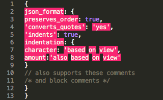
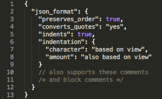

# IndentX 

IndentX is a forgiving indentation plugin for Sublime Text inspired by [Indent Xml](https://sublime.wbond.net/packages/Indent%20XML), aimed primarily at preserving attribute ordering and working with *invalid* content.

Supported content types:

* XML*-like* content
* JSON-*like* content

## Available Commands

* IndentX: Indent
* IndentX: Indent & format JSON
* IndentX: Convert JSON to YAML

Note: *IndentX: Convert JSON to YAML* should be considered *alpha*.

### IndentX: Indent

The *Indent* command will format both XML and JSON like content (content guess based on the first character `<` for XML) and can be accessed using the following keyboard short-cuts (think angle brackets: `control`/`command` + `k` + `<`):

* Windows: `control` + `k` + `,`
* Mac: `command` + `k` + `,`
* Linux: `control` + `k` + `,`

### IndentX: Indent & format JSON

The *Indent & format JSON* will try and indent and convert JavaScript-like objects to JSON (e.g. wrapping attributes in `"` and converting `'` strings to `"`). It can be accessed using the following keyboard short-cuts (think curly braces: `control`/`command` + `k` + `{`):

* Windows: `control` + `k` + `[`
* Mac: `command` + `k` + `[`
* Linux: `control` + `k` + `[`

*JSON before and after formatting:*

Note: If starting with a JavaScript object and you want to maintain the JavaScipt object format, use the [Indent](#Indenting) command instead.

### IndentX: Convert JSON to YAML

The *Convert JSON to YAML* command will try to convert a JSON document into YAML. As this feature is still very new, my personal experience with YAML is limited, this feature should be considered very *alpha*. Please [submit any issues](https://github.com/socsieng/IndentX/issues) you may have.

## How it works

IndentX uses regular expressions (probably more than it should) to identify tokens to:

* insert new lines
* increase indentation (begin tag/object)
* decrease indentation (end tag/object)

This technique has the following benefits:

* doesn't require valid strict XML or JSON (close enough should be good enough)
* preserves attribute order

## Installation

Install using Package Control.
